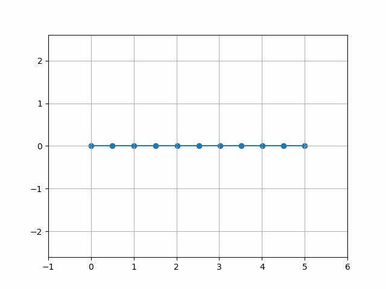

# Bezier Curve Splitter
This repository contains a python module that splits a bezier curve into several points with specified interval / distance.

## Example
<p align="center">
  
</p>

## Usage
1. Import splitter.
```python
import splitter
```
2. Initialize your bezier curve control points.
```python
control_points = [
  [0,  0],
  [0,  5],
  [5, -5],
  [5,  0]
]
```
3. Initialize the desired interval between points.
```python
interval = 0.5
```
4. Split the curve.
```python
time, points = splitter.split(control_points, interval)
```
